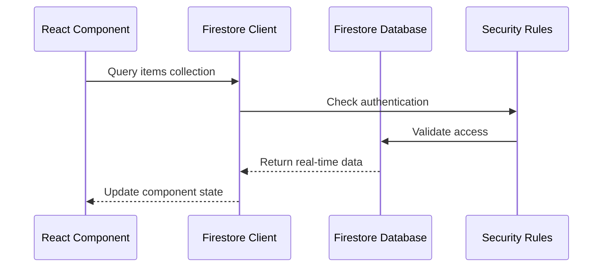
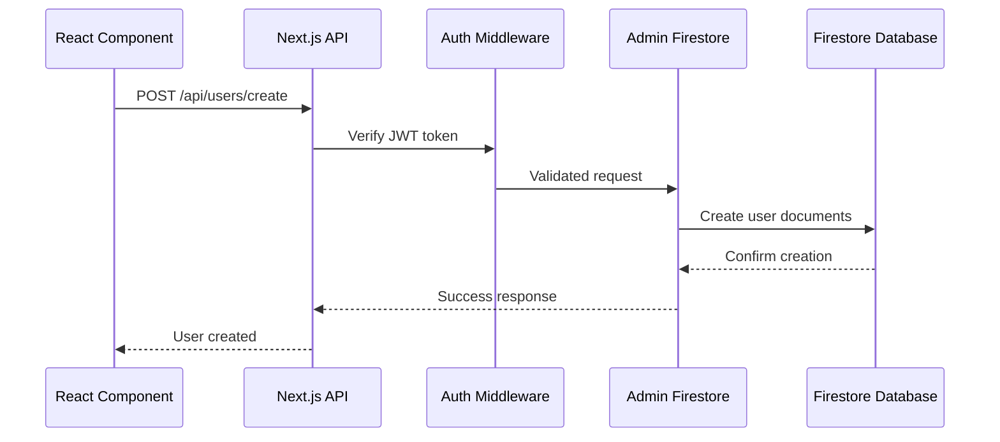
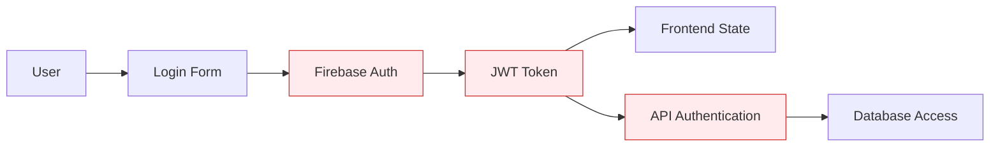

# Campus Marketplace - Architecture Layers Diagram

## System Architecture Overview
This diagram shows how data flows through the different layers of the Campus Marketplace application, from frontend to database.

```mermaid
graph TB
    %% Styling
    classDef frontend fill:#e3f2fd,stroke:#1976d2,stroke-width:2px,color:#0d47a1
    classDef ui fill:#f3e5f5,stroke:#7b1fa2,stroke-width:2px,color:#4a148c
    classDef nextjs fill:#fff3e0,stroke:#f57c00,stroke-width:2px,color:#e65100
    classDef api fill:#e8f5e8,stroke:#388e3c,stroke-width:2px,color:#1b5e20
    classDef firebase fill:#ffebee,stroke:#d32f2f,stroke-width:2px,color:#b71c1c
    classDef db fill:#fce4ec,stroke:#c2185b,stroke-width:2px,color:#880e4f

    %% Frontend Layer
    subgraph "Frontend Layer (Client-Side)"
        direction TB
        
        subgraph "React Components"
            LoginComp[Login Component<br/>src/app/login/page.tsx]:::ui
            RegisterComp[Register Component<br/>src/app/register/page.tsx]:::ui
            ProfileComp[Profile Components<br/>src/components/auth/]:::ui
            MarketComp[Marketplace Components<br/>src/components/marketplace/]:::ui
            UIComp[UI Components<br/>src/components/ui/]:::ui
        end
        
        subgraph "Firebase Client SDK"
            AuthClient[Firebase Auth<br/>signInWithEmailAndPassword<br/>createUserWithEmailAndPassword]:::firebase
            FirestoreClient[Firestore Client<br/>Direct DB Access<br/>Real-time queries]:::firebase
            StorageClient[Firebase Storage<br/>File uploads]:::firebase
        end
    end

    %% Next.js Framework Layer
    subgraph "Next.js Framework Layer"
        direction TB
        
        subgraph "App Router"
            LoginPage[/login]:::nextjs
            RegisterPage[/register]:::nextjs
            HomePage[/]:::nextjs
            APIRoutes[/api/*]:::nextjs
        end
        
        subgraph "Service Layer"
            FirebaseConfig[firebase-config.ts<br/>Client configuration]:::nextjs
            FirebaseLib[firebase.ts<br/>Client SDK initialization]:::nextjs
            AuthMiddleware[auth-middleware.ts<br/>Token validation]:::nextjs
        end
    end

    %% API Layer (Server-Side)
    subgraph "API Layer (Server-Side)"
        direction TB
        
        subgraph "Authentication APIs"
            LoginAPI[POST /api/login<br/>User authentication]:::api
            SyncAPI[POST /api/auth/sync-user<br/>Sync Firebase with DB]:::api
        end
        
        subgraph "User Management APIs"
            CreateUserAPI[POST /api/users/create<br/>Create new user]:::api
            ProfileAPI[GET /api/users/profile<br/>Get user profile]:::api
            UpdateAPI[PUT /api/users/update<br/>Update user info]:::api
            DeactivateAPI[PUT /api/users/deactivate<br/>Deactivate account]:::api
        end
        
        subgraph "Other APIs"
            PhotoAPI[POST /api/photos/upload<br/>Upload images]:::api
            SetupAPI[POST /api/setup-database<br/>Initialize DB]:::api
        end
    end

    %% Firebase Backend Services
    subgraph "Firebase Backend Services"
        direction TB
        
        subgraph "Firebase Authentication"
            FirebaseAuth[Firebase Auth<br/>User authentication<br/>JWT token validation]:::firebase
        end
        
        subgraph "Firebase Admin SDK"
            AdminAuth[Admin Auth<br/>Server-side token verification]:::firebase
            AdminFirestore[Admin Firestore<br/>Server-side DB operations]:::firebase
            AdminStorage[Admin Storage<br/>Server-side file operations]:::firebase
        end
    end

    %% Database Layer
    subgraph "Database Layer (Firestore)"
        direction TB
        
        subgraph "User Collections"
            UsersDB[(users<br/>User basic info)]:::db
            ProfilesDB[(userProfiles<br/>Extended user data)]:::db
            CartsDB[(carts<br/>User shopping carts)]:::db
        end
        
        subgraph "Marketplace Collections"
            CategoriesDB[(categories<br/>Item categories)]:::db
            ItemsDB[(items<br/>Marketplace items)]:::db
            PhotosDB[(item_photos<br/>Item images)]:::db
        end
        
        subgraph "Transaction Collections"
            OrdersDB[(orders<br/>Purchase orders)]:::db
            PaymentsDB[(payments<br/>Payment records)]:::db
            MessagesDB[(messages<br/>User communications)]:::db
        end
        
        subgraph "Firebase Storage"
            FileStorage[(Firebase Storage<br/>Images & Files)]:::db
        end
    end

    %% Data Flow Connections

    %% Frontend to Firebase Client
    LoginComp --> AuthClient
    RegisterComp --> AuthClient
    ProfileComp --> FirestoreClient
    MarketComp --> FirestoreClient
    UIComp --> StorageClient

    %% Frontend to Next.js APIs
    LoginComp --> LoginAPI
    RegisterComp --> CreateUserAPI
    ProfileComp --> ProfileAPI
    ProfileComp --> UpdateAPI

    %% Next.js Framework connections
    LoginPage --> LoginComp
    RegisterPage --> RegisterComp
    HomePage --> MarketComp
    APIRoutes --> LoginAPI
    APIRoutes --> CreateUserAPI
    
    FirebaseConfig --> AuthClient
    FirebaseLib --> FirestoreClient
    AuthMiddleware --> AdminAuth

    %% API to Firebase Admin
    LoginAPI --> AdminAuth
    SyncAPI --> AdminFirestore
    CreateUserAPI --> AdminFirestore
    ProfileAPI --> AdminFirestore
    UpdateAPI --> AdminFirestore
    PhotoAPI --> AdminStorage

    %% Firebase Auth connections
    AuthClient --> FirebaseAuth
    AdminAuth --> FirebaseAuth

    %% Direct Client to Database (bypassing APIs)
    FirestoreClient -.-> UsersDB
    FirestoreClient -.-> ItemsDB
    FirestoreClient -.-> MessagesDB
    StorageClient -.-> FileStorage

    %% API to Database connections
    AdminFirestore --> UsersDB
    AdminFirestore --> ProfilesDB
    AdminFirestore --> CartsDB
    AdminFirestore --> CategoriesDB
    AdminFirestore --> ItemsDB
    AdminFirestore --> PhotosDB
    AdminFirestore --> OrdersDB
    AdminFirestore --> PaymentsDB
    AdminFirestore --> MessagesDB
    AdminStorage --> FileStorage

    %% Security Rules (dotted lines indicate rule enforcement)
    FirebaseAuth -.-> UsersDB
    FirebaseAuth -.-> ProfilesDB
    FirebaseAuth -.-> ItemsDB
    FirebaseAuth -.-> MessagesDB
```

## Data Flow Patterns

### Pattern 1: Direct Frontend-to-Database (Real-time)


### Pattern 2: API-Mediated Database Access (Business Logic)


## Layer Responsibilities

### **Frontend Layer**
- **UI Components**: User interface and interactions
- **Firebase Client SDK**: Direct database access for real-time features
- **State Management**: Component state and user session

### **Next.js Framework Layer**
- **Routing**: Page navigation and API endpoints
- **Service Layer**: Configuration and utilities
- **Middleware**: Authentication and request processing

### **API Layer**
- **Business Logic**: Complex operations and validation
- **Authentication**: Token verification and user management
- **Data Processing**: Transform and validate data before storage

### **Firebase Backend**
- **Authentication**: User identity and session management
- **Admin SDK**: Server-side database operations with elevated permissions
- **Security Rules**: Access control and data validation

### **Database Layer**
- **Collections**: Organized data storage following ERD schema
- **Storage**: File and image storage
- **Indexes**: Query optimization and performance

## Security & Authentication Flow



This architecture provides:
- **Scalability**: Multiple data access patterns
- **Security**: Authentication at every layer
- **Performance**: Direct client access for real-time features
- **Flexibility**: API layer for complex business logic
- **Maintainability**: Clear separation of concerns
