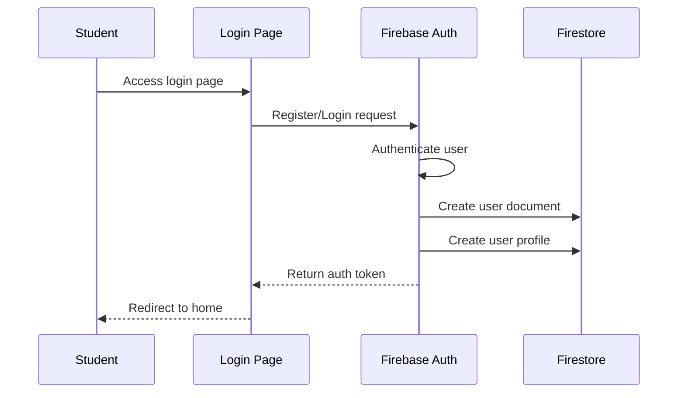
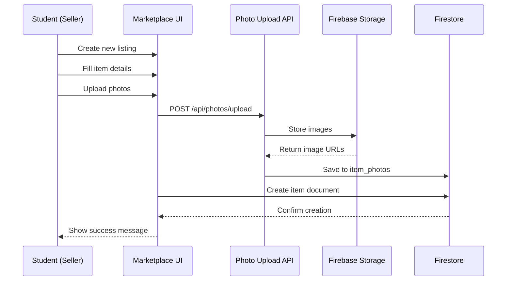
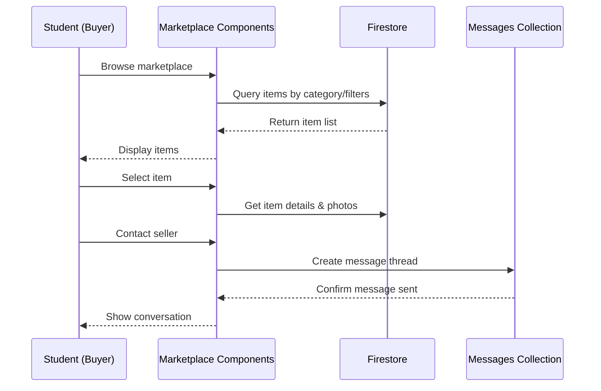

# Campus Marketplace — Data Flow Diagram

## System Overview
This diagram shows the data flow for the Campus Marketplace application, built with Next.js and Firebase.

```mermaid
flowchart TD
    %% =====================================================
    %% STYLING CLASSES
    classDef user fill:#e3f2fd,stroke:#1976d2,stroke-width:2px,color:#0d47a1
    classDef ui fill:#f3e5f5,stroke:#7b1fa2,stroke-width:2px,color:#4a148c
    classDef api fill:#fff3e0,stroke:#f57c00,stroke-width:2px,color:#e65100
    classDef firebase fill:#ffebee,stroke:#d32f2f,stroke-width:2px,color:#b71c1c
    classDef data fill:#e8f5e8,stroke:#388e3c,stroke-width:2px,color:#1b5e20

    %% =====================================================
    %% EXTERNAL USERS
    Student[Student<br/>Buyer/Seller]:::user
    Admin[Admin<br/>Moderator]:::user

    %% =====================================================
    %% FRONTEND COMPONENTS
    subgraph "Next.js Frontend"
        direction TB
        LoginPage[Login Page<br/>src/app/login/page.tsx]:::ui
        HomePage[Home Page<br/>src/app/page.tsx]:::ui
        PhotoUpload[Photo Upload<br/>src/components/PhotoUpload.tsx]:::ui
        AuthComponents[Auth Components<br/>src/components/auth/]:::ui
        MarketComponents[Marketplace Components<br/>src/components/marketplace/]:::ui
        UIComponents[UI Components<br/>src/components/ui/]:::ui
    end

    %% =====================================================
    %% API ROUTES
    subgraph "Next.js API Routes"
        direction TB
        LoginAPI[POST /api/login]:::api
        PhotoAPI[POST /api/photos/upload]:::api
        SetupAPI[POST /api/setup-database]:::api
    end

    %% =====================================================
    %% SERVICES LAYER
    subgraph "Service Layer"
        direction TB
        FirebaseConfig[Firebase Config<br/>src/lib/firebase-config.ts]:::api
        FirebaseLib[Firebase Lib<br/>src/lib/firebase.ts]:::api
        PhotoService[Photo Service<br/>src/lib/photoService.ts]:::api
        PhotoUploadLib[Photo Upload<br/>src/lib/photoUpload.ts]:::api
        DatabaseInit[Database Init<br/>src/lib/initializeDatabase.ts]:::api
    end

    %% =====================================================
    %% FIREBASE SERVICES
    subgraph "Firebase Backend"
        direction TB
        FirebaseAuth[Firebase Auth]:::firebase
        Firestore[Firestore Database]:::firebase
        FirebaseStorage[Firebase Storage]:::firebase
        CloudFunctions[Cloud Functions<br/>Optional]:::firebase
    end

    %% =====================================================
    %% DATA COLLECTIONS (Based on ERD)
    subgraph "Firestore Collections"
        direction TB
        UsersCollection[(users)]:::data
        ProfilesCollection[(user_profiles)]:::data
        CategoriesCollection[(categories)]:::data
        ItemsCollection[(items)]:::data
        PhotosCollection[(item_photos)]:::data
        CartsCollection[(carts)]:::data
        CartItemsCollection[(cart_items)]:::data
        OrdersCollection[(orders)]:::data
        OrderItemsCollection[(order_items)]:::data
        PaymentsCollection[(payments)]:::data
        MessagesCollection[(messages)]:::data
    end

    %% =====================================================
    %% USER FLOWS

    %% Authentication Flow
    Student --> LoginPage
    LoginPage --> LoginAPI
    LoginAPI --> FirebaseAuth
    FirebaseAuth --> UsersCollection
    FirebaseAuth --> ProfilesCollection

    %% Home/Browse Flow
    Student --> HomePage
    HomePage --> MarketComponents
    MarketComponents --> ItemsCollection
    ItemsCollection --> PhotosCollection
    ItemsCollection --> CategoriesCollection

    %% Photo Upload Flow
    Student --> PhotoUpload
    PhotoUpload --> PhotoAPI
    PhotoAPI --> PhotoService
    PhotoService --> FirebaseStorage
    PhotoService --> PhotosCollection

    %% Messaging Flow
    MarketComponents --> MessagesCollection

    %% Cart & Orders Flow
    MarketComponents --> CartsCollection
    CartsCollection --> CartItemsCollection
    CartItemsCollection --> OrdersCollection
    OrdersCollection --> OrderItemsCollection
    OrdersCollection --> PaymentsCollection

    %% Admin Flow
    Admin --> HomePage
    Admin --> SetupAPI
    SetupAPI --> DatabaseInit
    DatabaseInit --> CategoriesCollection

    %% Service Layer Connections
    FirebaseConfig --> FirebaseAuth
    FirebaseConfig --> Firestore
    FirebaseConfig --> FirebaseStorage
    
    FirebaseLib --> FirebaseAuth
    FirebaseLib --> Firestore
    
    PhotoUploadLib --> FirebaseStorage
    PhotoUploadLib --> Firestore
```



## Key User Journey Flows

### 1. User Registration & Authentication Flow


### 2. Item Listing Creation Flow


### 3. Browse & Purchase Flow


## Data Security & Access Control

- **Firebase Auth** handles all user authentication
- **Firestore Security Rules** control data access based on user authentication
- **Storage Rules** ensure only authenticated users can upload photos
- **API Routes** validate requests and enforce business logic

## Technology Stack

- **Frontend**: Next.js 14 with TypeScript
- **Backend**: Firebase (Auth, Firestore, Storage)
- **Styling**: Tailwind CSS
- **Deployment**: Vercel (recommended for Next.js)
- **Database**: Firestore (NoSQL document database)
```

## User Interface Flow Diagram

```mermaid
flowchart TD
    A[Login] --> B[Registration]
    B --> C[Home]
    C --> D[Local Database]
    D --> E[Discogs API]
    D --> F[Home/Search Collection]
    
    F --> G[Add Record]
    F --> H[Catalogue Screen]
    F --> I[Profile Management]
    
    G --> J[View Record Details]
    H --> K[Edit Folders]
    
    %% Styling
    classDef authStyle fill:#e1f5fe,stroke:#0277bd,stroke-width:2px
    classDef homeStyle fill:#f3e5f5,stroke:#7b1fa2,stroke-width:2px
    classDef dataStyle fill:#e8f5e8,stroke:#2e7d32,stroke-width:2px
    classDef actionStyle fill:#fff3e0,stroke:#ef6c00,stroke-width:2px
    
    class A,B authStyle
    class C,F homeStyle
    class D,E dataStyle
    class G,H,I,J,K actionStyle