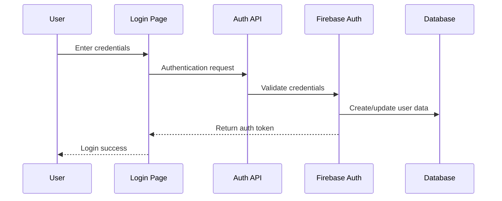
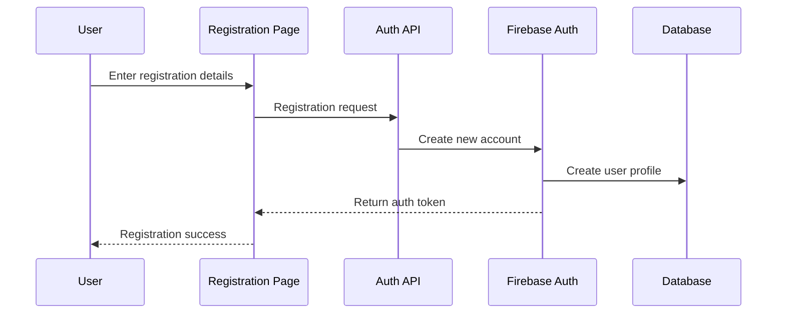
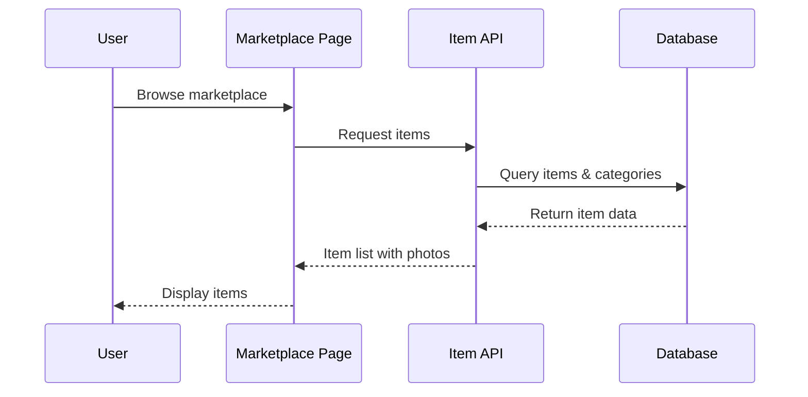
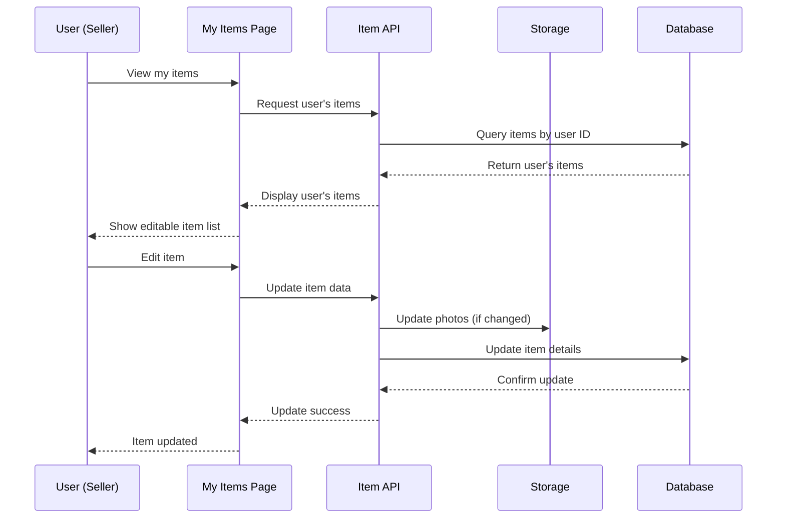
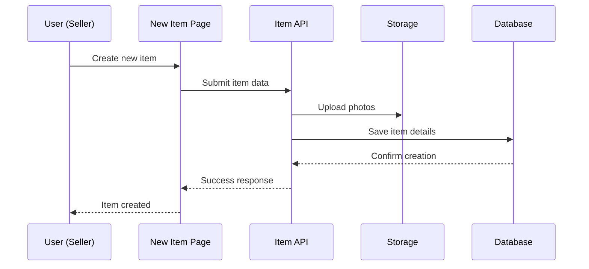
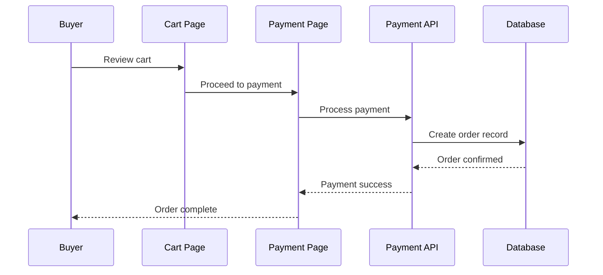

# Campus Marketplace — Data Flow Diagram

## System Overview
This diagram shows the data flow for the Campus Marketplace application, built with Next.js and Firebase.

```mermaid
flowchart TD
    %% =====================================================
    %% STYLING CLASSES
    classDef user fill:#e3f2fd,stroke:#1976d2,stroke-width:2px,color:#0d47a1
    classDef ui fill:#f3e5f5,stroke:#7b1fa2,stroke-width:2px,color:#4a148c
    classDef api fill:#fff3e0,stroke:#f57c00,stroke-width:2px,color:#e65100
    classDef firebase fill:#ffebee,stroke:#d32f2f,stroke-width:2px,color:#b71c1c
    classDef data fill:#e8f5e8,stroke:#388e3c,stroke-width:2px,color:#1b5e20

    %% =====================================================
    %% EXTERNAL USERS
    Student[Student<br/>Buyer/Seller]:::user
    Admin[Admin<br/>Moderator]:::user

    %% =====================================================
    %% FRONTEND COMPONENTS
    subgraph "Frontend Layer"
        direction TB
        LoginPage[Login Page]:::ui
        RegistrationPage[Registration Page]:::ui
        MarketplacePage[Marketplace Page]:::ui
        ItemDetailPage[Item Detail Page]:::ui
        ProfilePage[Profile Page]:::ui
        MyItemsPage[My Items Page]:::ui
        CartPage[Cart Page]:::ui
        PaymentPage[Payment Page]:::ui
        NewItemPage[New Item Page]:::ui
    end

    %% =====================================================
    %% API ROUTES
    subgraph "API Layer"
        direction TB
        AuthAPI[Authentication APIs]:::api
        UserAPI[User Management APIs]:::api
        ItemAPI[Item Management APIs]:::api
        PhotoAPI[Photo Upload APIs]:::api
        PaymentAPI[Payment APIs]:::api
        MessageAPI[Messaging APIs]:::api
    end

    %% =====================================================
    %% FIREBASE SERVICES
    subgraph "Firebase Backend"
        direction TB
        FirebaseAuth[Firebase Authentication]:::firebase
        Firestore[Firestore Database]:::firebase
        FirebaseStorage[Firebase Storage]:::firebase
        CloudFunctions[Cloud Functions]:::firebase
    end

    %% =====================================================
    %% DATA COLLECTIONS
    subgraph "Database Collections"
        direction TB
        UsersCollection[(Users & Profiles)]:::data
        ItemsCollection[(Items & Photos)]:::data
        TransactionCollection[(Orders & Payments)]:::data
        MessageCollection[(Messages)]:::data
        CategoryCollection[(Categories)]:::data
        CartCollection[(Carts)]:::data
    end

    %% =====================================================
    %% USER FLOWS

    %% Authentication Flow
    Student --> LoginPage
    Student --> RegistrationPage
    LoginPage --> AuthAPI
    RegistrationPage --> AuthAPI
    AuthAPI --> FirebaseAuth
    FirebaseAuth --> UsersCollection

    %% Marketplace Flow
    Student --> MarketplacePage
    MarketplacePage --> ItemAPI
    ItemAPI --> ItemsCollection
    ItemsCollection --> CategoryCollection

    %% Item Management Flow
    Student --> ItemDetailPage
    ItemDetailPage --> ItemAPI
    ItemDetailPage --> PhotoAPI
    PhotoAPI --> FirebaseStorage
    ItemAPI --> ItemsCollection

    %% My Items Management Flow
    Student --> MyItemsPage
    MyItemsPage --> ItemAPI
    MyItemsPage --> PhotoAPI

    %% New Item Creation
    Student --> NewItemPage
    NewItemPage --> ItemAPI
    NewItemPage --> PhotoAPI

    %% Profile Management
    Student --> ProfilePage
    ProfilePage --> UserAPI
    UserAPI --> UsersCollection

    %% Shopping Cart Flow
    Student --> CartPage
    CartPage --> ItemAPI
    CartPage --> PaymentAPI
    PaymentAPI --> TransactionCollection
    CartPage --> CartCollection

    %% Payment Flow
    CartPage --> PaymentPage
    PaymentPage --> PaymentAPI

    %% Messaging Flow
    ItemDetailPage --> MessageAPI
    MessageAPI --> MessageCollection

    %% Admin Flow
    Admin --> MarketplacePage
    Admin --> UserAPI
    Admin --> ItemAPI

    %% Firebase Service Connections
    AuthAPI --> FirebaseAuth
    UserAPI --> Firestore
    ItemAPI --> Firestore
    PhotoAPI --> FirebaseStorage
    PaymentAPI --> Firestore
    MessageAPI --> Firestore
```



## Key User Journey Flows

### 1. User Authentication Flow


### 2. User Registration Flow


### 3. Item Browsing Flow


### 4. My Items Management Flow


### 5. Item Creation Flow


### 6. Purchase Flow


## Data Flow Patterns

### Pattern 1: Direct Frontend-Database Access
**Used for**: Real-time browsing, simple queries, user interactions
```
Frontend Page → Firebase Client → Database Collections
```

### Pattern 2: API-Mediated Access
**Used for**: Complex operations, business logic, data validation
```
Frontend Page → API Layer → Firebase Backend → Database Collections
```

## Technology Stack Overview

- **Frontend**: React/Next.js pages and components
- **API Layer**: Next.js API routes for business logic
- **Backend**: Firebase services (Auth, Firestore, Storage)
- **Database**: Firestore collections following ERD schema
- **Authentication**: Firebase Auth with JWT tokens
- **File Storage**: Firebase Storage for images