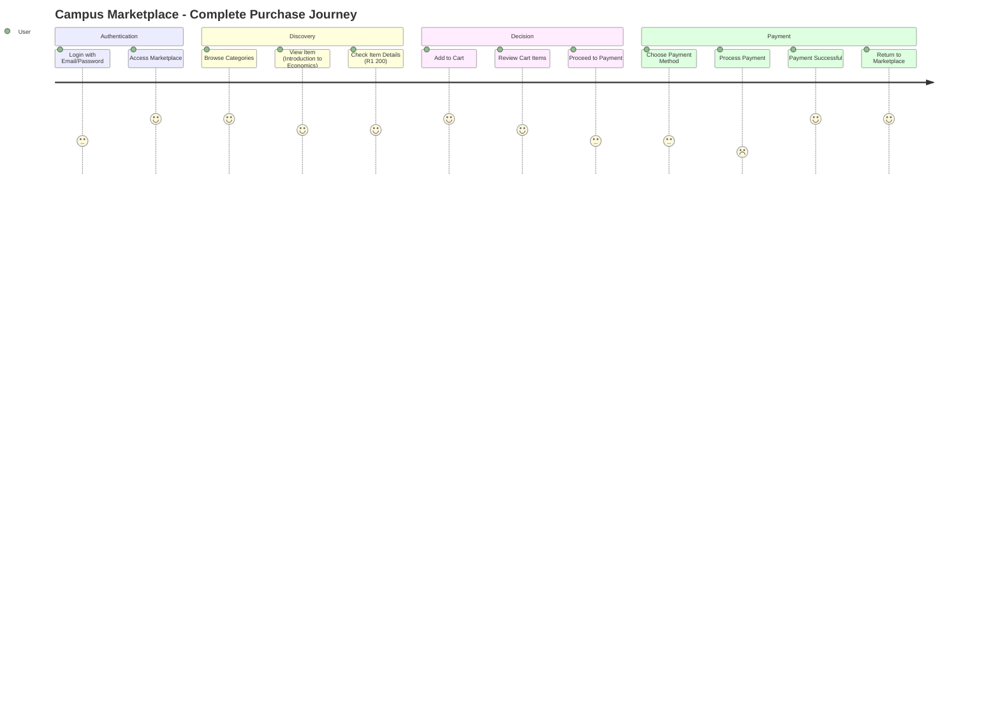
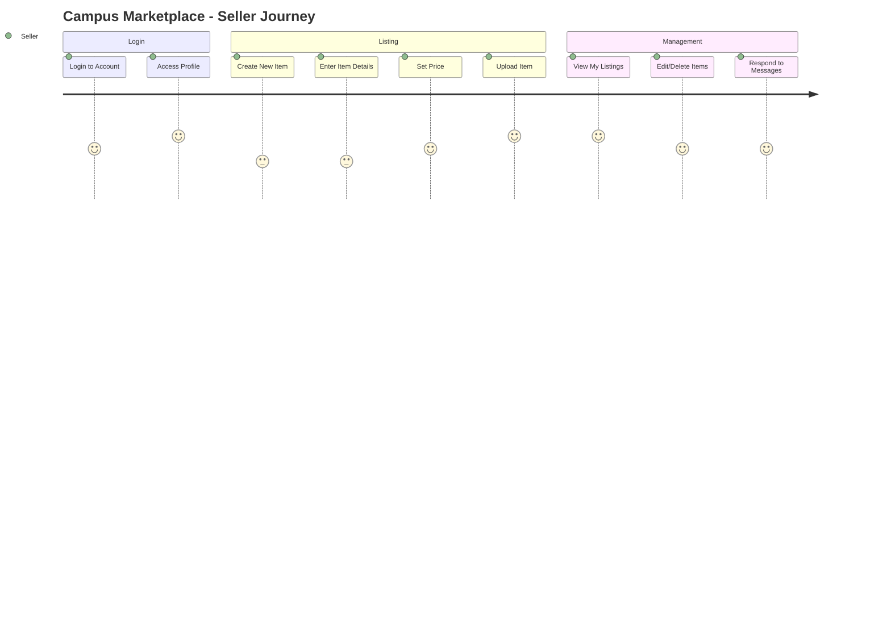
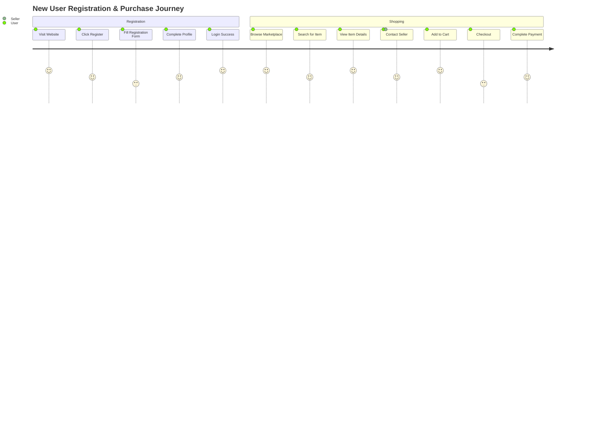
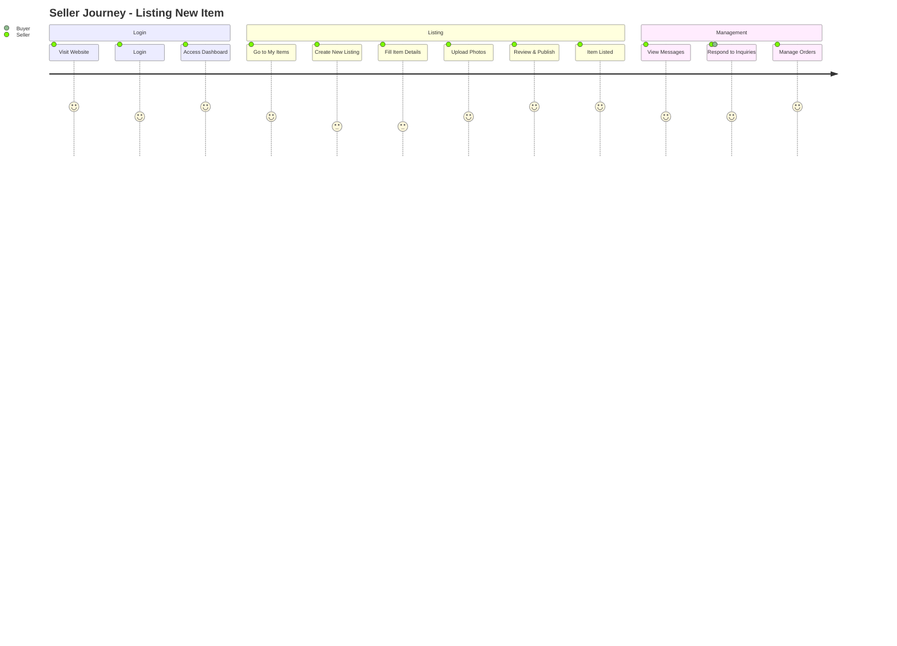
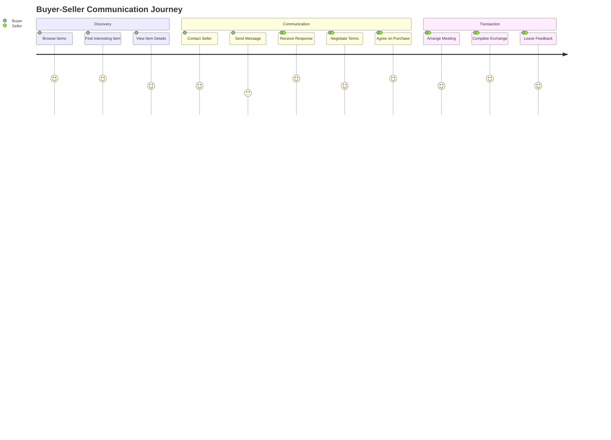

# Campus Marketplace - User Interface Flow Diagram

## User Journey & Interface Flow
This diagram shows the exact user flow based on the wireframe sections for Campus Marketplace.

```mermaid
flowchart TD
    %% Styling
    classDef auth fill:#e3f2fd,stroke:#1976d2,stroke-width:2px,color:#0d47a1
    classDef marketplace fill:#e8f5e8,stroke:#388e3c,stroke-width:2px,color:#1b5e20
    classDef item fill:#fff3e0,stroke:#f57c00,stroke-width:2px,color:#e65100
    classDef profile fill:#f3e5f5,stroke:#7b1fa2,stroke-width:2px,color:#4a148c
    classDef cart fill:#ffebee,stroke:#d32f2f,stroke-width:2px,color:#b71c1c
    classDef payment fill:#e0f2f1,stroke:#00695c,stroke-width:2px,color:#004d40

    %% Section 1: Login
    Section1[Section 1: Login<br/>Campus Marketplace<br/>• Email<br/>• Password<br/>• Login Button<br/>• Forgot Password]:::auth
    
    %% Section 2: Marketplace
    Section2[Section 2: Marketplace<br/>• Search Items<br/>• Categories:<br/>&nbsp;&nbsp;- New Items<br/>&nbsp;&nbsp;- Textbooks<br/>&nbsp;&nbsp;- Books<br/>&nbsp;&nbsp;- Electronics<br/>&nbsp;&nbsp;- Furniture<br/>• Introduction to Economics - R1 200]:::marketplace
    
    %% Section 3: Item Detail
    Section3[Section 3: Item Detail<br/>• Item Image<br/>• Introduction to Economics<br/>• R1 200<br/>• Posted on May 1<br/>• Seller: John Doe<br/>• Message Seller<br/>• Add to Cart]:::item
    
    %% Section 6: New Item to Sell
    Section6[Section 6: New Item to Sell<br/>• Title<br/>• Description<br/>• Price<br/>• Add Item/Upload<br/>• Cancel]:::item
    
    %% Section 7: My Items (Edit/Manage)
    Section7[Section 7: My Items<br/>• Listed Items Grid<br/>• Edit Item<br/>• Delete Item<br/>• Item Status<br/>• Create New Item]:::item
    
    %% Section 8: Profile
    Section8[Section 8: Profile<br/>• Profile Picture<br/>• John Doe<br/>• johndoe@myuni.ac.za<br/>• My Listings:<br/>&nbsp;&nbsp;- Introduction to Economics (Edit/Delete)<br/>&nbsp;&nbsp;- Math Study Notes (Edit/Delete)]:::profile
    
    %% Section 9: Cart
    Section9[Section 9: Cart<br/>• Item List:<br/>&nbsp;&nbsp;- Introduction to Economics R1 200<br/>&nbsp;&nbsp;- Introduction to Economics R1 200<br/>&nbsp;&nbsp;- Introduction to Economics R1 200<br/>&nbsp;&nbsp;- Introduction to Economics R1 200<br/>• Continue Shopping<br/>• Proceed to Payment]:::cart
    
    %% Section 4: Payment
    Section4[Section 4: Payment<br/>Campus Marketplace<br/>• Credit/Debit Card<br/>• Instant EFT<br/>• SnapScan<br/>• Pay Now Button]:::payment
    
    %% Section 10: Cart Details
    Section10[Section 10: Cart Details<br/>Payment processing...]:::payment
    
    %% Section 5: Payment Success
    Section5[Section 5: Payment Successful<br/>Order Summary<br/>• Introduction to Economics R1 200<br/>• Delivery cost (if needed) R 250<br/>• Total R1 250<br/>• Contact Seller (if needed)<br/>• Return to Main Page]:::payment

    %% Flow Connections
    Section1 --> Section2
    Section2 --> Section3
    Section2 --> Section6
    Section2 --> Section7
    Section3 --> Section9
    Section3 --> MessageSeller[Message Seller]:::item
    Section6 --> Section7
    Section7 --> Section6
    Section7 --> EditItem[Edit Item]:::item
    EditItem --> Section7
    Section9 --> Section4
    Section4 --> Section10
    Section10 --> Section5
    Section5 --> Section2
    Section2 --> Section8
    Section8 --> Section2
    Section8 --> Section7
    
    %% Additional Navigation
    Section9 --> ContinueShopping[Continue Shopping]:::cart
    ContinueShopping --> Section2
```

## Specific User Journey Based on Wireframe

### Complete Purchase Flow


### Seller Journey


## Page Sections Breakdown

### Section 1: Login Page
- **Campus Marketplace** branding
- **Email** input field
- **Password** input field  
- **Login** button
- **Forgot password** link

### Section 2: Marketplace (Main Hub)
- **Search Items** functionality
- **Category Navigation:**
  - New Items
  - Textbooks  
  - Books
  - Electronics
  - Furniture
- **Item Listings** (e.g., Introduction to Economics - R1 200)

### Section 3: Item Detail Page
- **Item Image** display
- **Item Title** (Introduction to Economics)
- **Price** (R1 200)
- **Post Date** (Posted on May 1)
- **Seller Information** (Seller: John Doe)
- **Message Seller** button
- **Add to Cart** button

### Section 6: New Item to Sell
- **Title** input field
- **Description** text area
- **Price** input field
- **Add Item/Upload** button
- **Cancel** button

### Section 7: My Items (Management Page)
- **Listed Items Grid** showing all user's items
- **Edit Item** functionality for each listing
- **Delete Item** option
- **Item Status** management (Available/Sold/Reserved)
- **Create New Item** quick action
- **Item Performance** (views, messages received)

### Section 8: Profile Page
- **Profile Picture** display
- **User Name** (John Doe)
- **Email** (johndoe@myuni.ac.za)
- **My Listings** section:
  - Introduction to Economics (Edit/Delete options)
  - Math Study Notes (Edit/Delete options)

### Section 9: Cart
- **Item List** with multiple entries:
  - Introduction to Economics R1 200 (×4)
- **Continue Shopping** button
- **Proceed to Payment** button

### Section 4: Payment Options
- **Campus Marketplace** header
- **Payment Methods:**
  - Credit/Debit Card
  - Instant EFT
  - SnapScan
- **Pay Now** button

### Section 10: Cart Details (Processing)
- Payment processing interface

### Section 5: Payment Success
- **Payment Successful** confirmation
- **Order Summary:**
  - Introduction to Economics R1 200
  - Delivery cost (if needed) R 250
  - Total R1 250
- **Contact Seller (if needed)** option
- **Return to Main Page** button

## Navigation Rules

### Primary Flow
1. **Login** → **Marketplace** → **Item Detail** → **Cart** → **Payment** → **Success**
2. **Marketplace** → **Profile** (manage account)
3. **Marketplace** → **My Items** (manage listings)
4. **Marketplace** → **New Item** (create listing)

### Item Management Flow
1. **My Items** → **Edit Item** → **Save Changes** → **My Items**
2. **My Items** → **Create New Item** → **New Item Form** → **My Items**
3. **My Items** → **Delete Item** → **Confirmation** → **My Items**

### Alternative Flows
- **Cart** → **Continue Shopping** → **Marketplace**
- **Payment Success** → **Return to Main Page** → **Marketplace**
- **Profile** → **My Items** → **Manage Listings**

This simplified flow matches exactly what's shown in your wireframe sections!

## User Journey Scenarios

### Scenario 1: New User Registration & First Purchase


### Scenario 2: Existing User Selling Items


### Scenario 3: Buyer-Seller Communication


## Page Wireframe Structure

### Authentication Pages
- **Login Page** (`/login`)
  - Email/Password form
  - Google OAuth button
  - Register link
  - Forgot password link

- **Register Page** (`/register`)
  - Registration form
  - Google OAuth button
  - Login link
  - Terms & conditions

### Main Application Pages
- **Home/Dashboard** (`/`)
  - Navigation menu
  - Quick actions
  - Recent activity
  - Featured items

- **Marketplace** (`/marketplace`)
  - Search bar
  - Category filters
  - Item grid/list
  - Pagination

- **Item Details** (`/item/[id]`)
  - Item photos
  - Description
  - Seller info
  - Contact buttons
  - Add to cart

### User Management Pages
- **Profile** (`/profile`)
  - Profile information
  - Edit options
  - Account settings
  - Activity history

- **My Items** (`/my-items`)
  - Listed items
  - Create new listing
  - Edit existing items
  - Order management

- **Messages** (`/messages`)
  - Conversation list
  - Message threads
  - New message option

- **Cart** (`/cart`)
  - Cart items
  - Quantity controls
  - Checkout button
  - Total calculation

## Navigation Flow Rules

### Authentication Required
- All pages except `/login` and `/register` require authentication
- Unauthenticated users redirect to login page
- Post-authentication redirect to intended page

### Permission-Based Access
- **Admin Panel**: Only accessible to admin users
- **My Items**: User can only see their own items
- **Messages**: User can only see their own conversations
- **Profile**: User can only edit their own profile

### Responsive Navigation
- **Desktop**: Full navigation menu always visible
- **Mobile**: Hamburger menu with responsive design
- **Breadcrumbs**: Show current location in app hierarchy

This interface flow provides a complete user experience from registration through all major features of your Campus Marketplace!
