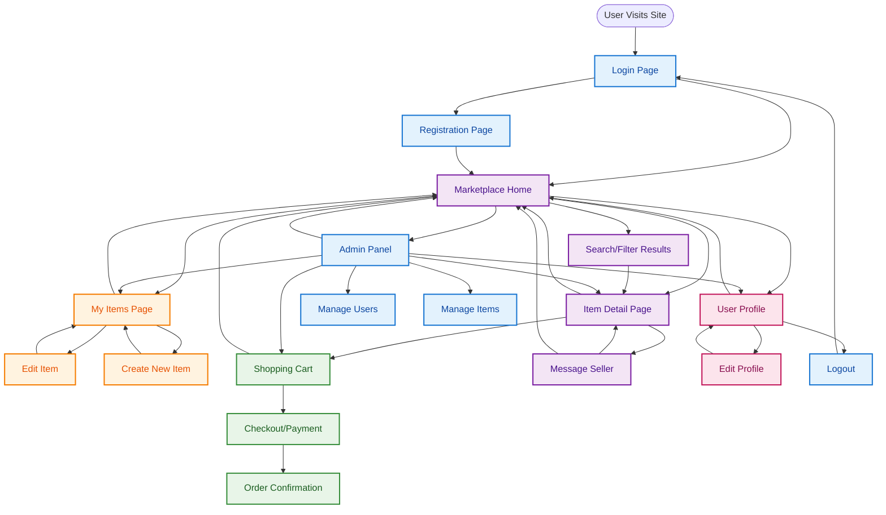

# Campus Marketplace — UI Flow Diagram

## Overall User Interface Navigation Flow

This diagram shows the high-level navigation flow between different pages and screens in the Campus Marketplace application.



## User Journey Flows

### 1. New User Journey
```
Visit Site → Login Page → Registration Page → Marketplace Home → Browse Items → Item Details
```

### 2. Returning User Journey
```
Visit Site → Login Page → Marketplace Home → Continue Shopping/Selling
```

### 3. Seller Journey
```
Marketplace Home → My Items Page → Create New Item / Edit Existing Item → Back to My Items
```

### 4. Buyer Journey
```
Marketplace Home → Browse/Search → Item Details → Add to Cart → Checkout → Order Confirmation
```

### 5. Communication Journey
```
Item Details → Message Seller → Message Thread → Back to Item Details
```

## Page Categories

### 🔐 **Authentication Pages**
- Login Page
- Registration Page
- Logout

### 🏠 **Main Marketplace Pages**
- Marketplace Home (item browsing)
- Item Detail Page
- Search/Filter Results
- Message Center

### 🛒 **Buyer Pages**
- Shopping Cart
- Checkout/Payment
- Order Confirmation

### 💼 **Seller Pages**
- My Items Page (manage listings)
- Create New Item
- Edit Item

### 👤 **Profile Pages**
- User Profile
- Edit Profile

### ⚙️ **Admin Pages**
- Admin Panel (exclusive admin access)
- Manage Users (user moderation)
- Manage Items (item moderation)
- **Plus full access to all other pages** (can use marketplace as buyer/seller)
- **Privacy Protection**: Cannot access encrypted private messages between users

## Key Navigation Patterns

### **Hub Navigation**
- **Marketplace Home** serves as the main navigation hub
- Users can access all major sections from the home page
- Consistent navigation bar across all pages

### **Breadcrumb Navigation**
- Clear path back to previous pages
- "Back to Marketplace" links from detail pages
- "Back to My Items" from item editing

### **Progressive Disclosure**
- Simple browsing → Detailed item view → Action (buy/message)
- Profile access from any page via header/menu
- Shopping cart accessible from item pages

### **Role-Based Navigation**
- **Buyers**: Focus on browsing, cart, and checkout flow
- **Sellers**: Access to "My Items" and item management
- **Admins**: **Full access to all pages and functionality** - can browse as buyer, manage items as seller, plus exclusive admin panel access
  - **Exception**: No access to encrypted private messages between users (privacy protection)

## Mobile Responsive Considerations

- **Bottom Navigation Bar** for primary actions (Home, Search, Cart, Profile)
- **Hamburger Menu** for secondary navigation
- **Swipe Gestures** for item browsing
- **Floating Action Button** for "Create New Item" (sellers)

This UI flow provides a clear overview of how users navigate through the Campus Marketplace application, with distinct paths for different user types and clear navigation patterns.
